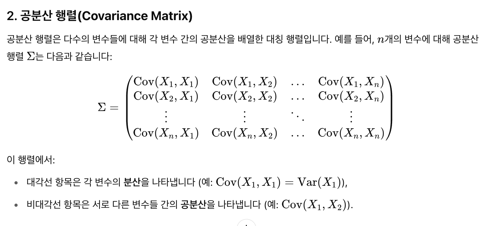

# 5주차: 분류 
* `predict와 predict_proba`: 모델은 단순 이진 분류 결과 할당을 넘어, 대부분 알고리즘은 관심 클래스에 속할 확률 점수(경향)을 반환함.
* `분류 항목과 결과가 세 개 이상이면`: 조건부 확률을 활용해 여러 개의 이진 문제로 돌려서 생각하기

## 5.1 나이브 베이즈 알고리즘
* 정의: Y=i를 관찰할 확률
* 특징
    * 모든 특징들이 `서로 독립(independent)`이라는 가정 (independent=naive)
    * 예측변수 및 결과 변수 모두 범주형 범수에서 사용. 수치형이라면 구간 분류를 통해 범주형으로 변환.
* 용어
    * 사후확률: 어떤 정보를 관측한 후, 어떤 사건이 일어날 업데이트된 확률
* 배경
    * 이전, 정확한 베이즈 분류기는 "완전히 같은 조합"을 찾는 방식
    * 현실에서는 조합이 너무 많고 데이터는 적어 적용이 어려움
    * 그래서 나이브 베이즈는 변수 간 독립성 가정을 통해 계산을 단순화함
    * 즉, 각 특성의 확률만 계산해서 곱하기. 독립성 가정을 안하면 모든 변수 조합에 대한 조건부 확률이 있어야 함.
* 활용 사례
    * 스팸 메일 분류: 이메일 본문의 단어를 기반으로 스팸인지 아닌지 분류
    * 문서 분류: 뉴스 기사, 블로그 포스트 등을 주제별로 자동 분류
    * 감성 분석: 리뷰, 댓글 등을 긍정/부정으로 분류
* 코드
```
predicted class: default
→ 모델은 이 고객이 대출을 상환하지 못할 것(default) 이라고 예측했습니다.

   default  paid off
0  0.653696  0.346304

**default (상환 실패)**일 확률: 65.4%

**paid off (상환 성공)**일 확률: 34.6%
```

## 5.2 판별 분석
* 목적: 주어진 데이터 포인트가 어떤 클래스를 나타내는지를 예측
    * 나이브 베이즈와 달리 범주형, 연속형 변수 상관 없음 
* 용어
    * 판별함수: 예측변수에 적용했을 때, 클래스 구분 최대화하는 함수 
    * 선형판별함수: 각 레코드가 어떤 클래스에 속할지 가중치를 구함
* 선형판별분석(LDA): 클래스별 데이터가 정규분포를 따르며, 모든 클래스가 동일한 공분산 행렬을 가진다고 가정.
* 공분산행렬: 변수가 많을 때 각 변수의 공분산을 보고 싶을 때 사용
    
* 피셔의 선행판별
    * 그룹 안의 편차와 다른 그룹 간 편차 구분 
    * LDA: 내부 제곱합 대비 사이 제곱합 최대화. 즉, 클래스 간 거리를 최대화하는 축을 찾는 것 
        * 제곱합 비율을 최대화하는 선형결합을 찾음
        * 내부 제곱합: 공분산행렬에 의해 
    * 왜 LDA에서 예측변수의 정규화 중요?
        * 공분산 행렬이 스케일의 영향을 받기 때문
        * 거리기반 알고리즘이기에 변수 스케일 중요
        * PCA vs LDA: PCA는 데이터 분산 보존을 최대로 보존하는 축 찾음 / LDA는 클래스 간 거리를 최대화, 클래스 내 거리를 최소화하는 축 찾음 
    * 왜 LDA에서 클래스들의 공분산행렬이 같아야 할까
        * LDA는 선형 관계를 찾는데, 두 클래스가 다른 분산 구조를 가지면 축 찾는게 힘듬요
    * QDA: 두 클래스가 서로 다른 공분산을 가질 수 있음

## 5.3 로지스틱 회귀 
* 특징: 구조화된 모델 접근 방식
* 용어
    * 로짓: 어떤 클래스에 속할 확률 결정 (0~1 사이가 아닌 임의의 실수값을 출력)
    * 오즈: 실패와 성공에 대한 비율
    * 로그 오즈: 변환 모델의 응답변수로 이값을 통해 확률을 구함 
* 선형회귀의 확장이며, 선형회귀는 응답변수가 실수지만 로지스틱 회귀는 0~1사이 확률을 예측함.
    * 기존 선형 회귀 모델 사용 시 P가 0~1사이가 안나올 수 있음
    * 예측변수에 로지스틱 반응 혹은 역 로짓 함수 사용 
* 오즈비: 두 그룹 간 오즈 비율 
    * 회귀계수는 예측변수에 대한 오즈비의 로그값 
    * log 씌우면 회귁계수의 지수함수 = 오즈비
* 진행
    * 로짓함수를 통해 로짓값 구함 (선형회귀에 X값을 넣어 오즈의 자연로그 값 = 로짓값 구함)
    
    * 로짓값을 확률로 변환 By 로지스틱 반응 함수 
* GLM
* 선형회귀와 로지스틱 차이
     * 모델 피팅 방식 (최소제곱X)
        * 최대우도측정(MLE): 우리가 보고 있는 데이터를 생성했을 가능성이 가장 높은 모델 피팅 
            * 예상 로그 오즈비(회귀계수)가 관찰된 결과를 잘 설명하는 모델
     * 잔차 특징과 분석
        * 결과변수가 이진형이기에 잔차 분석은 회귀선 기준 아래위로 나눠짐 
        * 잔차가 0이 거의 될 수 없는 이유
            * 잔차 = 결과 변수 - 모델 예측 확률

## 5.4 분류 모델 평가
* ROC 곡선 (재현율과 특이도)
    * 1을 잘 잡아내는 건 그만큼 0을 1로 잘못 예측할 가능성도 높아짐. 
    * 재현율과 특이도는 트레이드 오프 관계 
        * 민감도↑: 놓치지 않기 위해 더 많은 것을 잡으려 함 → 과잉 반응
        * 
        
        특이도↑: 정상만 골라내려 함 → 신중해짐 → 놓치기 쉬움

| 지표                          | 공식                                      | 설명                                                       | 주로 사용하는 상황                                               |
|-----------------------------|-----------------------------------------|------------------------------------------------------------|---------------------------------------------------------------|
| **정확도 (Accuracy)**        | (TP + TN) / (TP + TN + FP + FN)         | 전체 데이터 중에서 모델이 맞춘 비율 (전체 성능)                  | 일반적인 분류 문제 (클래스 비율 균형일 때)                        |
| **민감도 (Sensitivity / Recall)** | TP / (TP + FN)                         | 실제 양성 중에서 모델이 양성으로 예측한 비율 (놓치지 않음)       | 질병 진단, 침입 탐지 등 **양성을 놓치면 안 되는 경우**           |
| **특이도 (Specificity)**     | TN / (TN + FP)                          | 실제 음성 중에서 모델이 음성으로 예측한 비율 (정상 잘 걸러냄)     | 과잉 진단 방지, 검사 비용 줄이기 등 **음성을 잘 판별해야 하는 경우** |
| **정밀도 (Precision)**       | TP / (TP + FP)                          | 모델이 양성으로 예측한 것 중 실제 양성 비율 (틀리면 문제됨)       | 스팸 필터, 사기 탐지 등 **양성 예측이 틀리면 손해인 경우**         |

## 5.5 불균형 데이터 다루기 
* 용어
    * 과소표본: 개수 많은 크래스 데이터 중 일부 소수 사용 (다운샘플링)
    * 과잉샘플: 희귀 샘플 중복하여, 필요하면 부트스트랩에서 사용 (오버샘플링)
    * 상향가중치 혹은 하향 가중치: 희귀 혹은 높은 클래스에 가중치 부여 
    * 데이터 생성: 부트스트랩과 비슷하게 샘플링 레코드 빼고 원본과 살짝 다르게 다시 데이터 생성 
        * 스모트(SMOTE): 원래 레코드와 이웃 레코드의 랜덤 가중평균으로 새로운 합성 레코드 만듦
